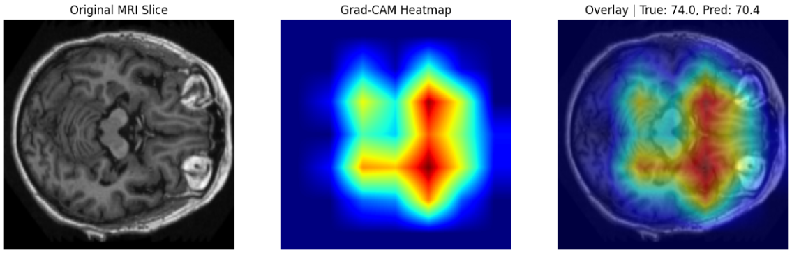

# Brain Age Prediction from MRI using Deep Learning (OASIS)

Deep learning project for estimating a subject's age directly from brain MRI slices using convolutional neural networks and transfer learning.  
Developed as part of a machine learning project at **Esprit School of Engineering**, with a focus on medical imaging and deep learning applications.

---

## Quick Summary

- **Problem:** predict chronological age from OASIS brain MRI data.
- **Best model:** EfficientNet-B0 with transfer learning and controlled fine-tuning.
- **Best metric:** validation Subject MAE of **~4.34 years**.
- **Pipeline:** two-stage workflow (fast model screening, then focused refinement).
- **Explainability:** Grad-CAM highlights anatomically meaningful brain regions.
- **Status:** reproducible research prototype in notebook format.

---

## Problem Overview

The goal is to predict **chronological age** from MRI brain scans.

Why this matters:
- Brain structure changes with age.
- A reliable brain-age model can help summarize complex MRI patterns into a single, interpretable value.

---

## Project Structure

```text
.
├── final-disc-all-last.ipynb
└── the-4-versions-with-ex-ai-last.ipynb
```

Notebook roles:
- `final-disc-all-last.ipynb`  
  Model selection notebook (architecture comparison on a smaller subset, then scaling strategy).
- `the-4-versions-with-ex-ai-last.ipynb`  
  EfficientNet-B0 refinement notebook (training strategy experiments + controlled hyperparameter tuning).

Grad-CAM visualizations are generated using the best saved model checkpoint (.pth), corresponding to the lowest validation error.

---

## Methodology

MRI volumes are converted into 2D axial slices, which are used as inputs to the convolutional neural networks.

### 1) Model Selection (Fast Comparison Stage)

Compared multiple pretrained models on a small subset (~39 subjects) for efficient screening:

- EfficientNet-B0
- ResNet18
- ResNet34
- DenseNet121

Outcome:
- **EfficientNet-B0** selected as the best backbone for the next phase.

### 2) EfficientNet-B0 Refinement

Using EfficientNet-B0 as fixed architecture, tested training strategies:

- **Baseline:** full fine-tuning, LR = `1e-4`
- **Lower LR:** full fine-tuning, LR = `1e-5`
- **Dropout:** dropout = `0.3`
- **Frozen backbone:** train head only

Then performed controlled tuning on key hyperparameters:

- Dropout: `0.2` vs `0.3`
- Learning rate: `1e-4` vs `5e-5`

### 3) Loss and Evaluation Setup

- **Loss function:** SmoothL1Loss
- **Primary metric:** Subject MAE
- **Secondary metric:** Slice MAE


Metric definitions:
- **MAE (Mean Absolute Error):** average difference between predicted and true age (in years)
- **Subject MAE:** predictions are aggregated per subject before computing MAE (primary metric)
- **Slice MAE:** computed at slice level (secondary metric)

### 4) Transfer Learning Strategy

The models are initialized from pretrained weights and fine-tuned on MRI data.  
This allows faster convergence and better performance compared to training from scratch.

---

## Results

- Best validation **Subject MAE: ~4.34 years**
- EfficientNet-B0 consistently provided the strongest performance after refinement.
- Subject-level aggregation provided a stable and meaningful assessment compared to slice-only evaluation.

This level of error suggests that the model captures meaningful age-related structural patterns in brain MRI data.

---

## Results Snapshot

| Experiment | Setup | Best Validation Subject MAE (years) | Notes |
|---|---|---:|---|
| Notebook 1 (scaled selection stage) | Best selected architecture retrained on 12 discs | ~4.59 (test subject MAE) | Screening-to-scaling workflow confirms architecture choice |
| Version 1 | EfficientNet-B0, full fine-tuning, LR = 1e-4 | 4.4696 | Strong baseline |
| Version 2 | EfficientNet-B0, full fine-tuning, LR = 1e-5 | 4.6927 | Learning too slow under fixed epoch budget |
| Version 3 | EfficientNet-B0, dropout = 0.3 | 4.5125 | Improved regularization behavior, slightly above baseline |
| Version 4 | EfficientNet-B0, frozen backbone | 16.6359 | Poor adaptation for this MRI domain |
| Final tuned configuration | EfficientNet-B0, dropout = 0.3, LR = 5e-5 | **4.3391** | Best reported validation result |

---

## Limitations

- Experiments are centered on a single dataset family (OASIS), so cross-site generalization is still limited.
- The pipeline uses 2D slice-based modeling, which can miss full 3D spatial context.
- External validation and broader demographic coverage are needed before clinical-level deployment.
- Explainability is qualitative (Grad-CAM) and should be complemented with stronger quantitative validation.

---

## Explainability (Grad-CAM)

To improve trust and interpretability, the project uses **Grad-CAM**:

- Highlights image regions that influence predictions the most.
- Visual analysis showed attention on anatomically meaningful brain regions rather than irrelevant background.
- Supports that the model is learning useful MRI aging patterns.

## Sample Output

Example Grad-CAM visualization showing model attention on an MRI slice:



*The model focuses on central brain regions associated with structural aging patterns, while ignoring irrelevant background.*

---

## Tech Stack

- Python
- PyTorch
- NumPy
- Matplotlib

---

## How to Run

### 1) Clone repository

```bash
git clone <your-repo-url>
cd <your-repo-folder>
```

### 2) Install dependencies

```bash
pip install torch torchvision numpy matplotlib pandas scikit-learn nibabel openpyxl jupyter
```

### 3) Prepare dataset

- Download and place OASIS data locally (or use Kaggle paths).
- Update dataset paths inside notebooks (e.g., `dataset_root`, `excel_path`) to match your environment.

### 4) Run notebooks

```bash
jupyter notebook
```

Recommended order:
1. `final-disc-all-last.ipynb` (model selection)
2. `the-4-versions-with-ex-ai-last.ipynb` (EfficientNet refinement and final tuning)

---

## Key Insights

- EfficientNet-B0 offered the best accuracy/efficiency trade-off for this task.
- Very low learning rates can slow adaptation and hurt results under limited epochs.
- Subject-level evaluation is essential for realistic brain-age assessment.
- Grad-CAM is useful to validate that predictions rely on meaningful brain regions.

---

## Future Work

- Increase subject diversity and sample size for stronger generalization.
- Add cross-validation and stronger external validation splits.
- Explore 3D CNNs or slice-sequence models instead of independent 2D slices.
- Test advanced augmentation and uncertainty estimation for clinical robustness.

---

## Suggested GitHub Topics

`python`, `deep-learning`, `medical-imaging`, `brain-age-prediction`, `mri`, `pytorch`
